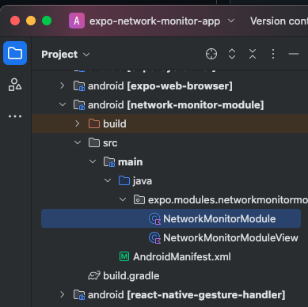

## Expo Network Monitor App

## 環境

- Node.js: v20.16.0
- npm: v10.8.1

## 1. プロジェクトの作成

```bash
npx create-expo-app@latest expo-network-monitor-app
```

```bash
cd expo-network-monitor-app
npm run ios
# または
npm run android
```

不要なボイラープレートを削除する。

```bash
npm run reset-project
rm -rf app-example
```

## 2. ローカル Expo Module の作成

```bash
npx create-expo-module@latest --local

✔ What is the name of the local module? … network-monitor-module
✔ What is the native module name? … NetworkMonitorModule
✔ What is the Android package name? … expo.modules.networkmonitormodule
```

app/index.tsx に以下のようにネイティブモジュールを組み込む。

```tsx
import { Text, View } from "react-native";
import NetworkMonitorModule from "../modules/network-monitor-module";
export default function Index() {
  return (
    <View
      style={{
        flex: 1,
        justifyContent: "center",
        alignItems: "center",
      }}
    >
      <Text>{NetworkMonitorModule.hello()}</Text>
    </View>
  );
}
```

## 3. ネイティブプロジェクトの生成

Expo Module の動作確認にはネイティブプロジェクト（ios/android ディレクトリ）が必要になるため、以下のコマンドで生成する。

```bash
npx expo prebuild --clean
```

Prebuild について: https://docs.expo.dev/workflow/prebuild/

## 4. Android Studio で android ディレクトリを開く

```bash
studio android
# または手動でAndroid Studioを開いてandroidディレクトリを開く
```

> [!NOTE] 
> `studio` コマンドは Android Studio を開いて Tools > Create Command-line Launcher...から設定できる。

## 5. Android Studio でアプリをビルドして起動する

## 5.1 Expo サーバーの起動

```bash
npm run start
```

## 5.2 Android Studio でビルド

Android Studio のメニューから `app` ボタンをクリックしてビルドを開始する。

無事にエミュレータが起動して「Hello world!」が表示されれば成功。

## 6. ネイティブモジュールの実装

左側のプロジェクトツリーから `NetworkMonitorModule.kt` を開く。



以下のようにモジュールを実装する。

```kotlin

package expo.modules.networkmonitormodule

import android.content.Context
import android.net.ConnectivityManager
import expo.modules.kotlin.modules.Module
import expo.modules.kotlin.modules.ModuleDefinition
import expo.modules.kotlin.exception.Exceptions

class NetworkMonitorModule : Module() {
  private val context: Context
    get() = appContext.reactContext ?: throw Exceptions.ReactContextLost()
  private val connectivityManager: ConnectivityManager
    get() = context.getSystemService(Context.CONNECTIVITY_SERVICE) as ConnectivityManager

  override fun definition() = ModuleDefinition {
    Name("NetworkMonitorModule")

    Function("isOnline") {
      val network = connectivityManager.activeNetwork
      val isOnline = network != null
      return@Function isOnline
    }
  }
}

```

さらに同じモジュールのディレクトリにある AndroidManifest.xml を以下のように編集してネットワークの状態を取得するためのパーミッションを追加する。

```xml
<manifest xmlns:android="http://schemas.android.com/apk/res/android">
    <uses-permission android:name="android.permission.ACCESS_NETWORK_STATE" />
</manifest>

```

次に modules/network-monitor-module/index.ts を以下のように実装する。

```typescript
import NetworkMonitorModule from "./src/NetworkMonitorModule";

export function isOnline(): boolean {
  return NetworkMonitorModule.isOnline();
}

export function isWifi(): boolean {
  return NetworkMonitorModule.isWifi();
}
```

## 7. アプリにネイティブモジュールを組み込む

app/index.tsx に以下のようにネイティブモジュールを組み込む。

```typescript
import { Button, StyleSheet, Text, View } from "react-native";
import { isOnline, isWifi } from "../modules/network-monitor-module";
import { useState } from "react";

export default function Index() {
  const [online, setOnline] = useState<boolean>(isOnline());
  const [wifi, setWifi] = useState<boolean>(isWifi());
  return (
    <View style={styles.container}>
      <Text
        style={[
          styles.text,
          {
            color: online ? "green" : "red",
          },
        ]}
      >
        {online ? "オンラインです" : "オフラインです"}
      </Text>
      <Text
        style={[
          styles.text,
          {
            color: wifi ? "green" : "red",
          },
        ]}
      >
        Wifi: {wifi ? "接続中" : "未接続"}
      </Text>
      <Button
        title="更新"
        onPress={() => {
          setOnline(isOnline());
          setWifi(isWifi());
        }}
      />
    </View>
  );
}

const styles = StyleSheet.create({
  container: {
    flex: 1,
    justifyContent: "center",
    alignItems: "center",
  },
  text: {
    fontSize: 20,
    marginBottom: 20,
    fontWeight: "bold",
  },
});
```

## 8. 動作確認

```bash
npm run android
```

で Android アプリのビルド + Expo の開発サーバーを起動する。

または

```bash
npm run start
```

を実行して Expo の開発サーバーを起動し、
Android Studio でビルドして起動する。

## (Mac のみ) iOS のネイティブモジュールの実装

```swift
import ExpoModulesCore
import Network

public class NetworkMonitorModule: Module {
  private let monitor = NWPathMonitor()
  private let monitorQueue = DispatchQueue.global(qos: .default)

  public func definition() -> ModuleDefinition {
    Name("NetworkMonitorModule")

    OnCreate {
        monitor.start(queue: monitorQueue)
    }

    OnDestroy {
        monitor.cancel()
    }

    Function("isOnline") {
        let currentPath = monitor.currentPath
        let isOnline = currentPath.status == .satisfied
        print(currentPath.status)
        return isOnline
    }

    Function("isWifi") {
        let currentPath = monitor.currentPath
        let isWifi = currentPath.usesInterfaceType(.wifi)
        return isWifi
    }
  }
}
```
