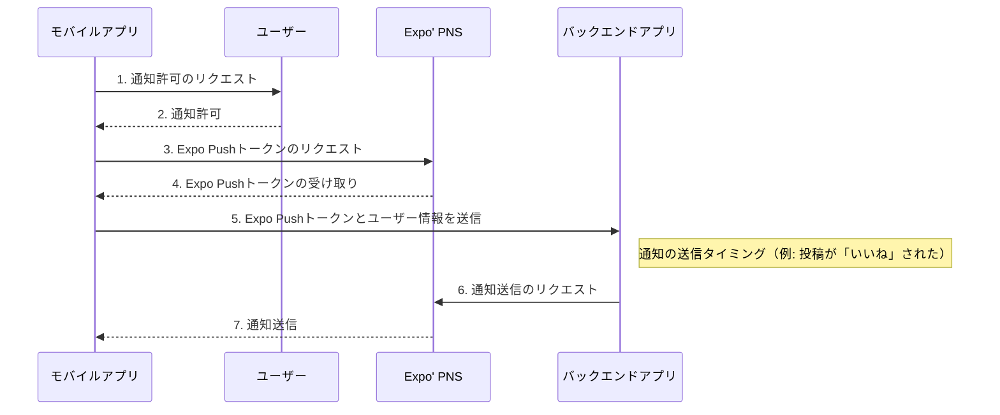

## Expo Push Notifications App

## 環境

- Node.js: v20.16.0
- npm: v10.8.1

## 必要なもの

- [Expo アカウント](https://expo.dev/)
- [Firebase アカウント](https://firebase.google.com/)
- EAS CLI

## Push 通知の流れ



## 1. プロジェクトの作成

```bash
npx create-expo-app@latest expo-push-notifications-app
```

```bash
cd expo-push-notifications-app
npm run ios
# または
npm run android
```

不要なボイラープレートを削除する。

```bash
npm run reset-project
rm -rf app-example
```

## 2. ライブラリのインストール

```bash
npx expo install expo-notifications expo-device expo-constants
```

## 3. Push 通知の実装

app/index.tsx を以下のように書き換える。

```tsx
import { useState, useEffect, useRef } from "react";
import { Text, View, Platform } from "react-native";
import * as Device from "expo-device";
import * as Notifications from "expo-notifications";
import Constants from "expo-constants";

Notifications.setNotificationHandler({
  handleNotification: async () => ({
    shouldShowAlert: true,
    shouldPlaySound: false,
    shouldSetBadge: false,
  }),
});

function handleRegistrationError(errorMessage: string) {
  alert(errorMessage);
  throw new Error(errorMessage);
}

async function registerForPushNotificationsAsync() {
  if (Platform.OS === "android") {
    Notifications.setNotificationChannelAsync("default", {
      name: "default",
      importance: Notifications.AndroidImportance.MAX,
      vibrationPattern: [0, 250, 250, 250],
      lightColor: "#FF231F7C",
    });
  }

  if (Device.isDevice) {
    const { status: existingStatus } =
      await Notifications.getPermissionsAsync();
    let finalStatus = existingStatus;
    if (existingStatus !== "granted") {
      const { status } = await Notifications.requestPermissionsAsync();
      finalStatus = status;
    }
    if (finalStatus !== "granted") {
      handleRegistrationError(
        "Permission not granted to get push token for push notification!"
      );
      return;
    }
    const projectId =
      Constants?.expoConfig?.extra?.eas?.projectId ??
      Constants?.easConfig?.projectId;
    if (!projectId) {
      handleRegistrationError("Project ID not found");
    }
    try {
      const pushTokenString = (
        await Notifications.getExpoPushTokenAsync({
          projectId,
        })
      ).data;
      console.log(pushTokenString);
      return pushTokenString;
    } catch (e: unknown) {
      handleRegistrationError(`${e}`);
    }
  } else {
    handleRegistrationError("Must use physical device for push notifications");
  }
}

export default function Index() {
  const [expoPushToken, setExpoPushToken] = useState("");
  const [notification, setNotification] = useState<
    Notifications.Notification | undefined
  >(undefined);
  const notificationListener = useRef<Notifications.Subscription>();
  const responseListener = useRef<Notifications.Subscription>();

  useEffect(() => {
    registerForPushNotificationsAsync()
      .then((token) => setExpoPushToken(token ?? ""))
      .catch((error: any) => setExpoPushToken(`${error}`));

    notificationListener.current =
      Notifications.addNotificationReceivedListener((notification) => {
        setNotification(notification);
      });

    responseListener.current =
      Notifications.addNotificationResponseReceivedListener((response) => {
        console.log(response);
      });

    return () => {
      notificationListener.current &&
        Notifications.removeNotificationSubscription(
          notificationListener.current
        );
      responseListener.current &&
        Notifications.removeNotificationSubscription(responseListener.current);
    };
  }, []);

  return (
    <View
      style={{ flex: 1, alignItems: "center", justifyContent: "space-around" }}
    >
      <Text>Your Expo push token: {expoPushToken}</Text>
      <View style={{ alignItems: "center", justifyContent: "center" }}>
        <Text>
          Title: {notification && notification.request.content.title}{" "}
        </Text>
        <Text>Body: {notification && notification.request.content.body}</Text>
        <Text>
          Data:{" "}
          {notification && JSON.stringify(notification.request.content.data)}
        </Text>
      </View>
    </View>
  );
}
```

## 4. EAS Build のセットアップ

EAS CLI のインストールとログインをしていなければ以下を実行する。

```bash
npm install -g eas-cli
eas login
```

以下コマンドで EAS Build のセットアップを行う。

```bash
eas build:configure
```

実行が成功すると、eas.json が生成される。

```json
{
  "cli": {
    "version": ">= 13.1.1",
    "appVersionSource": "remote"
  },
  "build": {
    "development": {
      "developmentClient": true,
      "distribution": "internal"
    },
    "preview": {
      "distribution": "internal"
    },
    "production": {
      "autoIncrement": true
    }
  },
  "submit": {
    "production": {}
  }
}
```

## 5. app.json の設定

app.json の`android.package`にパッケージ名を設定する。

```json
{
  "expo": {
    "android": {
      "package": "com.example.myapp"
    }
  }
}
```

## 4. Google サービスアカウントキーをプロジェクトへ追加する

https://docs.expo.dev/push-notifications/fcm-credentials/ の「Create a new Google Service Account Key」の手順に従って Google サービスアカウントキーを作成し、プロジェクトへ追加する。

補足:

- Step 5 で google-services.json のダウンロードは Firebase のプロジェクト上で Android アプリを追加が必要

### (オプショナル) google-services.json を git 管理しないようにする方法

1. `google-services.json`を.gitignore に追加して git 管理外にする
2. EAS Build で使えるようにするために、google-services.json を EAS サーバーにアップロードする

```bash
eas secret:create --scope project --name GOOGLE_SERVICES_JSON --type file --value ./google-services.json
```

3. app.json を app.config.ts に変更し、環境変数 GOOGLE_SERVICES_JSON を参照するようにする

```ts
export default {
  ...
  android: {
    googleServicesFile: process.env.GOOGLE_SERVICES_JSON ?? './google-services.json',
    ...
  },
};
```

## 5. Development Build を作成する

Push 通知機能のデバッグを行うために、[Development Build](https://docs.expo.dev/develop/development-builds/introduction/) をセットアップする。

まず、`expo-dev-client` パッケージをインストールする。

```bash
npx expo install expo-dev-client
```

以下のコマンドで Development Build を作成する。

```bash
eas build --profile development --platform android
```

ビルドが完了したら発行された URL にアクセスし、「Install」ボタンをクリック、表示された QR コードを Android 端末で読み取り、apk ファイルをダウンロードする。
ダウンロードが完了したら、端末に apk ファイルをインストールする。

## 6. 動作確認

```bash
npm start
```

ターミナルに表示された QR コードを Expo Go アプリまたは QR コードスキャナーで読み取り、Development Build アプリを起動する。

アプリが起動して、Push 通知の許可を求めるダイアログが表示されたら許可する。

その後、アプリの画面とターミナルに Push 通知のトークンが表示されるので、コピーしておく。

[Push notifications tool](https://expo.dev/notifications)でコピーしたトークンを入力し、Push 通知を送信する。

アプリがバックグラウンドにある場合、Push 通知が届くと通知が表示される。
アプリがフォアグラウンドにある場合、Push 通知が届くと画面に通知内容が表示される。
